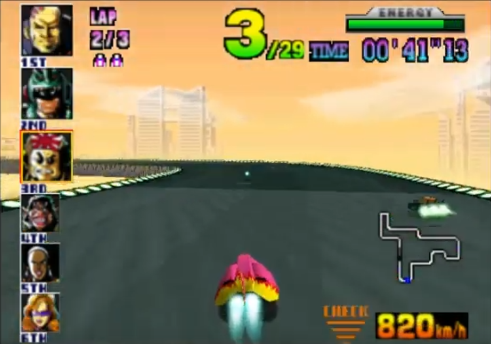
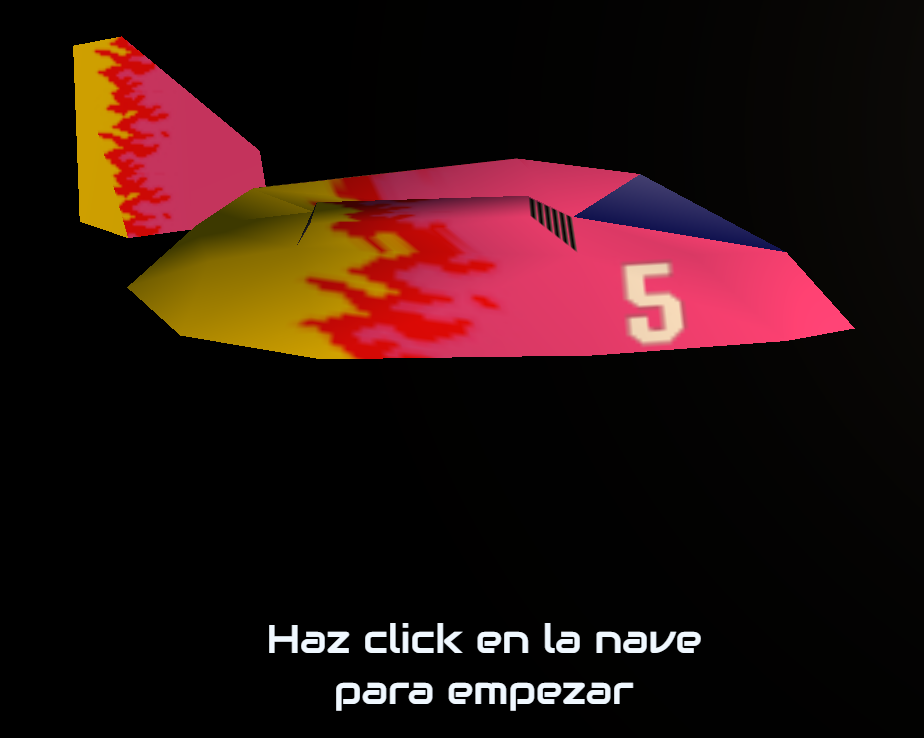
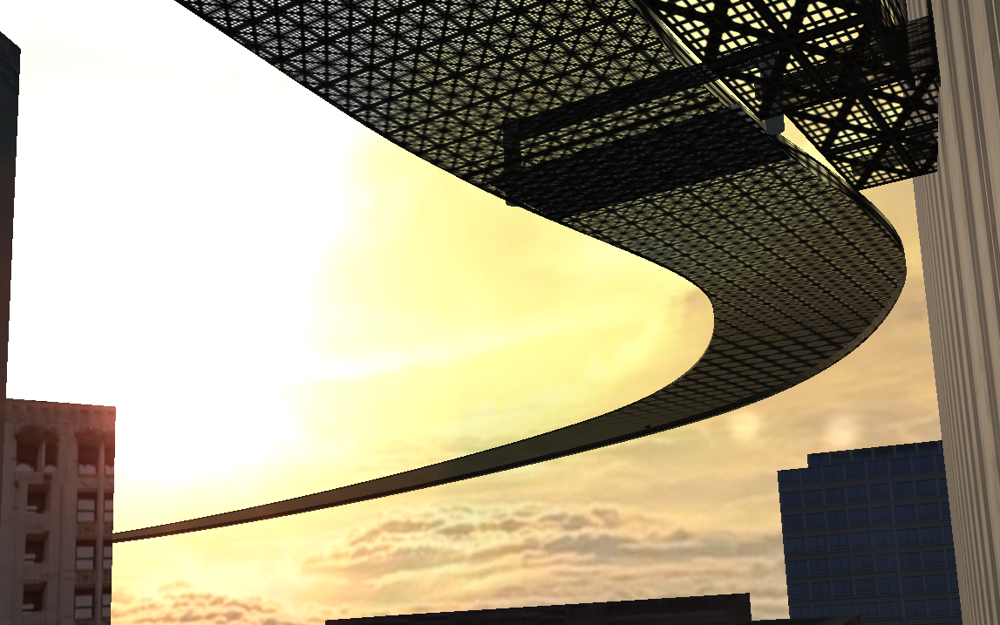
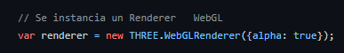
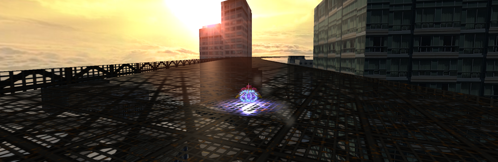
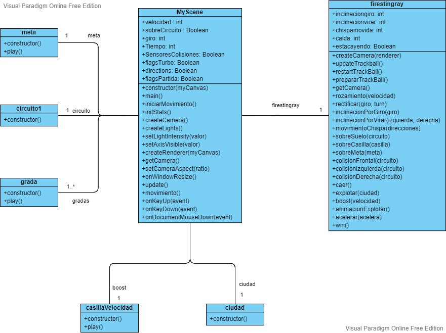

### Practicas de Informática Gráfica en la Universidad de Granada, curso 2021/2022
#### Realizado por Jordi Conde Molina y Pablo Borrego Megas

# README de [F-Alpha](https://finno51.github.io/SG/)

> Inspiración

> Resultado

En la propuesta de proyecto se indicó que, en caso de tener tiempo, se
implementarían corredores IA y antigravedad. En el proceso de
desarrollo, vimos que estas ideas iban más enfocadas a la lógica del
proyecto y no tanto al uso de particularidades de Three.js. Por eso se
han ido añadiendo otros elementos más enfocados a explotar lo que esta
biblioteca nos ofrece.

A continuación, por orden de aparición al ejecutar, se irán analizando
los objetos implementados al proyecto:

## Picker con raycast

Lo primero que aparece en pantalla es la nave de lado sobre un fondo
negro. Este menú está pensado para implementar selección por ratón,
usando un raycast. Con la función setFromCamera(), se puede colocar el
origen del raycast en el punto exacto de la cámara, y la dirección
hacia donde apunta el ratón.

> Problemas:
Pese a ser un proceso bastante sencillo, se atragantó por una
nimiedad: en lugar de usar la función intersectObject(), usamos
intersectObject**s**(). El proceso de depuración por esto fue difícil,
probamos gran cantidad de cosas pero nada funcionaba. En el momento
que nos dimos cuenta del error funcionó al instante.

## Cuenta atrás con Tween

La animación de la cuenta atrás empieza al hacer click en la nave. Al
hacerlo se inicia una compleja secuencia de movimientos programados
con Tween. Primero, el fondo y la nave se mueven hacia la cámara hasta
atravesarla para dejar ver el estado inicial del juego. Después,
empieza la cuenta atrás, donde cada número tiene tres movimientos: uno
con frenado que dirige el número hacia el ecuador de la pantalla,
luego uno constante corto y por último uno acelerado que lo saca de
pantalla. Al desaparecer el 1, se activa la flag de inicio del juego y
aparece el "Go!", el cual empieza con escalado 0,0 y va creciendo
mientras tiembla (haciendo traslaciones pequeñas con randoms) y pierde
opacidad.

> Problemas:
El efecto deseado para el "Go!" es que acompañe a la nave una vez
iniciado el juego, por tanto debe ser objeto hijo de este. Esto dio
algunos obstáculos a la hora de desarrollar, debido a la diferencia
entre contexto local y contexto global, pero al final se pudo
implementar.

## Videos con THREE.VideoTexture

Se crearon tres clases diferentes que implementan videos: grada.js,
meta.js y casillaVelocidad.js. Estos se crearon para poder tratarlos como un
único elemento e inicializar más de uno en la escena (como es el caso
de las gradas). Por convenio, los videos no pueden iniciarse sin que
el usuario haya realizado un input en la página. Por eso, al darle
click a la nave al principio se activa el flag que reproduce todos los
videos en la escena.

## TrackballControls

Para añadir más funcionalidad con el ratón, se implementó la clase
TrackballControls.

Podría parecer sencillo, pero tiene cierta profundidad en nuestro
caso, ya que la cámara está iniciada en la clase de la nave, por lo
que está en un contexto diferente de la escena global. Ya que Three.js
usa coordenadas de posición en contexto local y coordenadas de
dirección en contexto global, dificultó la implementación.

>Problemas:
TrackballControls tiene un atributo llamado target, el cual indica el
punto sobre el que gira la cámara. Por el tema de los contextos
mencionado previamente, este atributo provocó confusión, ya que no
sabíamos si utilizar coordenadas globales o locales. En el proceso de
depuración hubo dos estados destacables, representados en las
siguientes imágenes:

Una vez descubierto que el atributo target debía ser en contexto
local, el proceso de depuración fue más cómodo.

## Nave

El objeto complejo en nuestro proyecto es la nave. Está compuesto por
el cuerpo de la nave, el alerón, la cámara y diferentes planos y luces
para los efectos. El movimiento en sí se aplica a todo el objeto nave
desde MyScene, mientras que las inclinaciones, animación del alerón y
movimientos de cámara se aplican en la clase nave. Los diferentes
efectos se hacen visibles en sus respectivas funciones, por ejemplo el
efecto de chispa se activa solo cuando están activados el giro hacia
un lado y el viraje hacia la misma dirección.

>Problemas:
Debido a que se necesitaba mucho más control sobre las animaciones de
lo que ofrece Tween, ya que estas deben poder cortarse en cualquier
momento y combinarse unas con otras, se ha animado usando contadores y
otras flags gestionadas a mano. Esto ha llevado a que toda la
animación fuese compleja de desarrollar, pero consiguió un resultado
muy satisfactorio.

## Circuito y ciudad

Al principio el circuito, generado con un ExtrudeGeometry(), era un
simple óvalo. Después, al añadir la ciudad para decorar, se ajustó la
curva del camino para que pasase entre los edificios.

Estos dos elementos son los interactúan principalmente con la nave.
Esta contiene seis raycasters: tres para choques con la valla, dos
para choques con la ciudad y uno para detectar el suelo y diferentes
paneles. Los tres primeros empujan la nave cuando detectan una valla,
el frontal empujando el valor negativo de el atributo velocidad y los
laterales empujando en 1 hacia su lado negativo. El que detecta el
suelo inicia la animación de caída cuando deja de detectarlo, y los
otros dos (uno frontal y uno inferior) inician la animación de
explosión cuando detectan la ciudad.

>Problemas:
Intentamos hacer que las vallas estuviesen en puntos elegidos a mano
usando operaciones booleanas: con un polígono cortaríamos las vallas
en los puntos donde no queríamos que hubiesen. Por alguna razón que
desconocemos, esto causa que los cuadros por segundo fueran alrededor
de 10, así que para poder mostrar el correcto funcionamiento de tanto
el choque como la caída, nos tocó dejar un lado con valla y otro sin
valla. Sospechamos que este problema es porque, al pasar el circuito
por un CSG, este pasa a tener gran cantidad de vértices, lo cual
conlleva una gran carga computacional.

## Iluminación y LensFlare

La escena cuenta con dos tipos de iluminación principales: un
PointLight y un AmbientLight. El primero es para simular luz solar, y
el segundo para evitar que la escena esté muy oscura en partes donde
no dé la primera luz. Estas luces se han iniciado con un color
parecido al de la skybox para que la iluminación de la escena tenga un
aspecto realista. También se ha implementado la clase LensFlare para
un mejor efecto.

>Problemas:
>Aparte de LensFlare, también se intentó que el PointLight emitiese
>sombras. Se implementó todo lo necesario: las flags de los objetos 3D
>para que pudiesen recibir y proyectar sombras, activar la matriz de
>sombras del renderer, activar la emisión de sombras de la luz, etc.
>Por alguna razón que desconocemos, seguía sin funcionar. Sospechamos
>que es porque la nave y la ciudad son objetos importados.

>Por otro lado, el LensFlare tuvo sus propios problemas. Al
>implementarlo, en lugar del efecto deseado se veía un cuadrado negro
>en su lugar, además de un error de WebGL en terminal. Al final resultó
>que la solución era activar el canal alfa en el renderer.

>
>

## Turbo y caída

Aquí es donde más se juega con la cámara. En el turbo, se inicia una
animación que cambia el FOV y hace que tiemble, mientras que en la
caída se mueve la cámara independientemente de la nave para que 
mantenga su posición en el eje Y.

>Problemas:
Al principio, si la nave se quedaba estática en el turbo el FOV
empezaba a aumentar indefinidamente. Esto se solucionó con un conjunto
de flags. Además de esto, costó descubrir cómo modificar el FOV.
Simplemente modificar el atributo no funcionaba, y pensamos que
tocaría usar la función setFocalLength(), la cual no entendíamos cómo
funcionaba. Al final resulta que simplemente había que llamar a la
función updateProjectionMatrix() después de modificar el atributo FOV.

## Diagrama de clases

En el diagrama de clases no se puede apreciar con mucho detalle la
función de cada una de ellas pero nos sirve para poder ver la
distribución de los métodos más importantes y los atributos más
destacados. Cabe destacar que pese al enorme número de "atributos"
usados en las clases MyScene y firestringray se han seleccionados los
más "importantes" y se han agrupado los menos importantes con nombres
como por ejemplo "flagsPartida".
