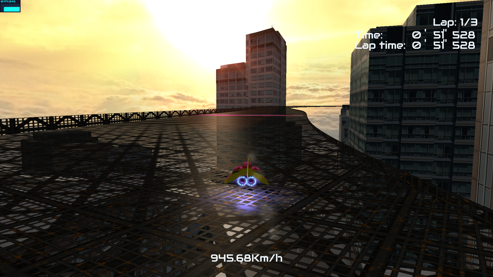

> **Memoria proyecto F-Alpha**

{width="5.5625in"
height="3.9069444444444446in"}

Inspiración

{width="5.5625in"
height="3.136110017497813in"}

Resultado

Jugable

> En la propuesta de proyecto se indicó que, en caso de tener tiempo, se
> implementarían corredores IA y antigravedad. En el proceso de
> desarrollo, vimos que estas ideas iban más enfocadas a la lógica del
> proyecto y no tanto al uso de particularidades de Three.js. Por eso se
> han ido añadiendo otros elementos más enfocados a explotar lo que esta
> biblioteca nos ofrece.
>
> A continuación, por orden de aparición al ejecutar, se irán analizando
> los objetos implementados al proyecto:
>
> **Picker con raycast**

+----------------------------------+----------------------------------+
| > Lo primero que aparece en      | > {width="2.5in" |
| > menú está pensado para         | > height="1.9791655730533684in"} |
| > implementar selección por      |                                  |
| > ratón, usando un raycast. Con  |                                  |
| > la función setFromCamera(), se |                                  |
| > puede colocar el origen del    |                                  |
| > raycast en el punto exacto de  |                                  |
| > la cámara, y la dirección      |                                  |
| > hacia donde apunta el ratón.   |                                  |
| >                                |                                  |
| > [Problemas:]{.ul}\             |                                  |
| > Pese a ser un proceso bastante |                                  |
| > sencillo, se atragantó por una |                                  |
| > nimiedad: en lugar de usar la  |                                  |
| > función\                       |                                  |
| > intersectObject(), usamos      |                                  |
| > intersectObject**s**(). El     |                                  |
+==================================+==================================+
| > proceso de depuración por esto |                                  |
| > fue difícil, probamos          |                                  |
+----------------------------------+----------------------------------+
| > gran cantidad de cosas pero    |                                  |
| > nada funcionaba. En el momento |                                  |
| > que nos dimos cuenta del       |                                  |
+----------------------------------+----------------------------------+
| > error funcionó al instante.    |                                  |
+----------------------------------+----------------------------------+

> **Cuenta atrás con Tween**

+----------------------------------+----------------------------------+
| > La animación de la cuenta      | > {width="2.5930555555555554in" |
| > inicia una compleja secuencia  | > height="1.7916666666666667in"} |
| > de movimientos programados     |                                  |
| > con\                           |                                  |
| > Tween. Primero, el fondo y la  |                                  |
| > nave se mueven hacia la cámara |                                  |
| > hasta atravesarla para dejar   |                                  |
| > ver el estado inicial del      |                                  |
| > juego. Después, empieza la     |                                  |
| > cuenta atrás, donde cada       |                                  |
| > número tiene tres movimientos: |                                  |
| > uno con frenado que dirige el  |                                  |
| > número hacia el ecuador de la  |                                  |
| > pantalla, luego uno constante  |                                  |
| > corto y por\                   |                                  |
| > último uno acelerado que lo    |                                  |
| > saca de pantalla. Al           |                                  |
+==================================+==================================+
| desaparecer el 1, se activa la   |                                  |
| flag de inicio del juego y       |                                  |
| aparece el "Go!", el cual        |                                  |
| empieza con                      |                                  |
+----------------------------------+----------------------------------+
| > escalado 0,0 y va creciendo    |                                  |
| > mientras tiembla (haciendo     |                                  |
| > traslaciones pequeñas con      |                                  |
+----------------------------------+----------------------------------+
| > randoms) y pierde opacidad.    |                                  |
+----------------------------------+----------------------------------+
| > [Problemas:]{.ul}              |                                  |
+----------------------------------+----------------------------------+
| > El efecto deseado para el      |                                  |
| > "Go!" es que acompañe a la     |                                  |
| > nave una vez iniciado el       |                                  |
| > juego, por                     |                                  |
+----------------------------------+----------------------------------+
| > tanto debe ser objeto hijo de  |                                  |
| > este. Esto dio algunos         |                                  |
| > obstáculos a la hora de        |                                  |
| > desarrollar,                   |                                  |
+----------------------------------+----------------------------------+
| > debido a la diferencia entre   |                                  |
| > contexto local y contexto      |                                  |
| > global, pero al final se pudo  |                                  |
+----------------------------------+----------------------------------+
| > implementar.                   |                                  |
+----------------------------------+----------------------------------+

> **Videos con THREE.VideoTexture**

+----------------------------------+----------------------------------+
| > Se crearon tres clases         | > {width="3.156943350831146in" |
| > meta.js y casillaVelocidad.js. | > height="1.6763877952755906in"} |
| > Estos se crearon para poder    |                                  |
| > tratarlos como un único        |                                  |
| > elemento e inicializar más de  |                                  |
| > uno en la escena (como es el   |                                  |
| > caso de las gradas). Por       |                                  |
| > convenio, los videos no pueden |                                  |
| > iniciarse sin que el\          |                                  |
| > usuario haya realizado un      |                                  |
| > input en la\                   |                                  |
| > página. Por eso, al darle      |                                  |
| > click a la nave al principio   |                                  |
| > se activa el flag que          |                                  |
| > reproduce todos los videos en  |                                  |
| > la escena.                     |                                  |
+----------------------------------+----------------------------------+

> **TrackballControls**

+----------------------------------+----------------------------------+
| > Para añadir más funcionalidad  | > {width="3.136110017497813in" |
| >                                | > height="1.9583333333333333in"} |
| > Podría parecer sencillo, pero  |                                  |
| > tiene cierta profundidad en    |                                  |
| > nuestro caso, ya que la\       |                                  |
| > cámara está iniciada en la     |                                  |
| > clase de la nave, por lo que   |                                  |
| > está en un contexto diferente  |                                  |
| > de la escena global. Ya que    |                                  |
| > Three.js usa\                  |                                  |
| > coordenadas de posición en     |                                  |
| > contexto local y coordenadas   |                                  |
| > de dirección en contexto\      |                                  |
| > global, dificultó la           |                                  |
| > implementación.                |                                  |
+==================================+==================================+
| > [Problemas:]{.ul}              |                                  |
+----------------------------------+----------------------------------+
| > TrackballControls tiene un     |                                  |
| > atributo llamado target, el    |                                  |
| > cual indica el punto sobre el  |                                  |
| > que gira la                    |                                  |
+----------------------------------+----------------------------------+
| > cámara. Por el tema de los     |                                  |
| > contextos mencionado           |                                  |
| > previamente, este atributo     |                                  |
| > provocó                        |                                  |
+----------------------------------+----------------------------------+
| > confusión, ya que no sabíamos  |                                  |
| > si utilizar coordenadas        |                                  |
| > globales o locales. En el      |                                  |
| > proceso de                     |                                  |
+----------------------------------+----------------------------------+
| > depuración hubo dos estados    |                                  |
| > destacables, representados en  |                                  |
| > las siguientes imágenes:       |                                  |
+----------------------------------+----------------------------------+
| > {width="2.636111111111111in" | ng){width="3.4694444444444446in" |
| > height="1.625in"}              | > height="1.625in"}              |
+----------------------------------+----------------------------------+

> Una vez descubierto que el atributo target debía ser en contexto
> local, el proceso de depuración fue más cómodo.
>
> **Nave**

+----------------------------------+----------------------------------+
| > El objeto complejo en nuestro  | > {width="2.969443350831146in" |
| > nave, el alerón, la cámara y   | > height="2.009721128608924in"}  |
| > diferentes planos y luces para |                                  |
| > los efectos. El movimiento en  |                                  |
| > sí se aplica a todo el objeto  |                                  |
| > nave desde MyScene, mientras   |                                  |
| > que las inclinaciones,         |                                  |
| > animación del alerón y         |                                  |
| > movimientos de cámara se       |                                  |
| > aplican en la clase nave. Los  |                                  |
| > diferentes efectos se hacen    |                                  |
| > visibles en sus respectivas    |                                  |
| > funciones, por\                |                                  |
| > ejemplo el efecto de chispa se |                                  |
| > activa solo                    |                                  |
+==================================+==================================+
| > cuando están activados el giro |                                  |
| > hacia un lado y                |                                  |
+----------------------------------+----------------------------------+
| > el viraje hacia la misma       |                                  |
| > dirección.                     |                                  |
+----------------------------------+----------------------------------+
| > [Problemas:]{.ul}              |                                  |
+----------------------------------+----------------------------------+
| > Debido a que se necesitaba     |                                  |
| > mucho más control sobre las    |                                  |
| > animaciones de lo que ofrece   |                                  |
+----------------------------------+----------------------------------+
| > Tween, ya que estas deben      |                                  |
| > poder cortarse en cualquier    |                                  |
| > momento y combinarse unas con  |                                  |
+----------------------------------+----------------------------------+
| > otras, se ha animado usando    |                                  |
| > contadores y otras flags       |                                  |
| > gestionadas a mano. Esto ha    |                                  |
| > llevado                        |                                  |
+----------------------------------+----------------------------------+
| > a que toda la animación fuese  |                                  |
| > compleja de desarrollar, pero  |                                  |
| > consiguió un resultado muy     |                                  |
+----------------------------------+----------------------------------+
| > satisfactorio.                 |                                  |
+----------------------------------+----------------------------------+

> **Circuito y ciudad**

+----------------------------------+----------------------------------+
| > Al principio el circuito,      | > , era un      | ng){width="2.1138877952755903in" |
| > simple óvalo. Después, al      | > height="2.2916666666666665in"} |
| > añadir la ciudad para decorar, |                                  |
| > se ajustó la curva del camino  |                                  |
| > para que pasase entre los      |                                  |
| > edificios.                     |                                  |
| >                                |                                  |
| > Estos dos elementos son los    |                                  |
| > interactúan principalmente con |                                  |
| > la nave. Esta contiene seis    |                                  |
| > raycasters: tres para\         |                                  |
| > choques con la valla, dos para |                                  |
| > choques con la ciudad y uno    |                                  |
| > para detectar el suelo y       |                                  |
| > diferentes paneles. Los tres\  |                                  |
| > primeros empujan la nave       |                                  |
| > cuando detectan una valla, el  |                                  |
| > frontal empujando el valor     |                                  |
| > negativo de el atributo        |                                  |
| > velocidad y los laterales      |                                  |
| > empujando en 1 hacia su lado   |                                  |
| > negativo. El que detecta el    |                                  |
| > suelo inicia la animación de   |                                  |
| > caída cuando                   |                                  |
+==================================+==================================+
| > deja de detectarlo, y los      |                                  |
| > otros dos (uno frontal y uno   |                                  |
| > inferior) inician la animación |                                  |
| > de                             |                                  |
+----------------------------------+----------------------------------+
| > explosión cuando detectan la   |                                  |
| > ciudad.                        |                                  |
+----------------------------------+----------------------------------+
| > [Problemas:]{.ul}              |                                  |
+----------------------------------+----------------------------------+
| > Intentamos hacer que las       |                                  |
| > vallas estuviesen en puntos    |                                  |
| > elegidos a mano usando         |                                  |
| > operaciones                    |                                  |
+----------------------------------+----------------------------------+
| > booleanas: con un polígono     |                                  |
| > cortaríamos las vallas en los  |                                  |
| > puntos donde no queríamos que  |                                  |
+----------------------------------+----------------------------------+
| > hubiesen. Por alguna razón que |                                  |
| > desconocemos, esto causa que   |                                  |
| > los cuadros por segundo        |                                  |
+----------------------------------+----------------------------------+
| > fueran alrededor de 10, así    |                                  |
| > que para poder mostrar el      |                                  |
| > correcto funcionamiento de     |                                  |
| > tanto el                       |                                  |
+----------------------------------+----------------------------------+
| > choque como la caída, nos tocó |                                  |
| > dejar un lado con valla y otro |                                  |
| > sin valla. Sospechamos que     |                                  |
+----------------------------------+----------------------------------+
| > este problema es porque, al    |                                  |
| > pasar el circuito por un CSG,  |                                  |
| > este pasa a tener gran         |                                  |
| > cantidad                       |                                  |
+----------------------------------+----------------------------------+
| > de vértices, lo cual conlleva  |                                  |
| > una gran carga computacional.  |                                  |
+----------------------------------+----------------------------------+

> **Iluminación y LensFlare**

+----------------------------------+----------------------------------+
| > La escena cuenta con dos tipos | > {width="2.5305555555555554in" |
| > El primero es para simular luz | > height="2.4055555555555554in"} |
| > solar, y el segundo para       |                                  |
| > evitar que la escena esté muy  |                                  |
| > oscura en partes donde no dé   |                                  |
| > la primera luz. Estas luces se |                                  |
| > han iniciado con un color      |                                  |
| > parecido al de la skybox para  |                                  |
| > que la iluminación de la       |                                  |
| > escena tenga un aspecto        |                                  |
| > realista. También se ha        |                                  |
| > implementado la clase\         |                                  |
| > LensFlare para un mejor        |                                  |
| > efecto.                        |                                  |
| >                                |                                  |
| > [Problemas:]{.ul}\             |                                  |
| > Aparte de LensFlare, también   |                                  |
| > se intentó que el PointLight   |                                  |
| > emitiese sombras. Se           |                                  |
| > implementó todo lo             |                                  |
+==================================+==================================+
| > necesario: las flags de los    |                                  |
| > objetos 3D para que            |                                  |
+----------------------------------+----------------------------------+
| > pudiesen recibir y proyectar   |                                  |
| > sombras, activar la matriz de  |                                  |
| > sombras del renderer, activar  |                                  |
| > la                             |                                  |
+----------------------------------+----------------------------------+
| > emisión de sombras de la luz,  |                                  |
| > etc. Por alguna razón que      |                                  |
| > desconocemos, seguía sin       |                                  |
+----------------------------------+----------------------------------+
| > funcionar. Sospechamos que es  |                                  |
| > porque la nave y la ciudad son |                                  |
| > objetos importados.            |                                  |
+----------------------------------+----------------------------------+
| > Por otro lado, el LensFlare    |                                  |
| > tuvo sus propios problemas. Al |                                  |
| > implementarlo, en lugar del    |                                  |
+----------------------------------+----------------------------------+
| > efecto deseado se veía un      |                                  |
| > cuadrado negro en su lugar,    |                                  |
| > además de un error de WebGL en |                                  |
+----------------------------------+----------------------------------+
| > terminal. Al final resultó que |                                  |
| > la solución era activar el     |                                  |
| > canal alfa en el renderer.     |                                  |
+----------------------------------+----------------------------------+
| > {width="2.1152777777777776in" | png){width="4.030555555555556in" |
| > height="1.625in"}              | > height="0.625in"}              |
+----------------------------------+----------------------------------+

> **Turbo y caída**

+----------------------------------+----------------------------------+
| > Aquí es donde más se juega con | > {width="3.176388888888889in" |
| > cambia el FOV y hace que       | > height="1.0305555555555554in"} |
| > tiemble,\                      |                                  |
| > mientras que en la caída se    |                                  |
| > mueve la\                      |                                  |
| > cámara independientemente de   |                                  |
| > la nave                        |                                  |
+==================================+==================================+
| > para que mantenga su posición  |                                  |
| > en el eje Y.                   |                                  |
+----------------------------------+----------------------------------+
| > [Problemas:]{.ul}              |                                  |
+----------------------------------+----------------------------------+
| > Al principio, si la nave se    |                                  |
| > quedaba estática en el turbo   |                                  |
| > el FOV empezaba a aumentar     |                                  |
+----------------------------------+----------------------------------+
| > indefinidamente. Esto se       |                                  |
| > solucionó con un conjunto de   |                                  |
| > flags. Además de esto, costó   |                                  |
+----------------------------------+----------------------------------+
| > descubrir cómo modificar el    |                                  |
| > FOV. Simplemente modificar el  |                                  |
| > atributo no funcionaba, y      |                                  |
+----------------------------------+----------------------------------+
| > pensamos que tocaría usar la   |                                  |
| > función setFocalLength(), la   |                                  |
| > cual no entendíamos cómo       |                                  |
+----------------------------------+----------------------------------+
| > funcionaba. Al final resulta   |                                  |
| > que simplemente había que      |                                  |
| > llamar a la función            |                                  |
+----------------------------------+----------------------------------+
| > updateProjectionMatrix()       |                                  |
| > después de modificar el        |                                  |
| > atributo FOV.                  |                                  |
+----------------------------------+----------------------------------+

> **Diagrama de clases**

{width="6.270833333333333in"
height="4.697222222222222in"}

> En el diagrama de clases no se puede apreciar con mucho detalle la
> función de cada una de ellas pero nos sirve para poder ver la
> distribución de los métodos más importantes y los atributos más
> destacados. Cabe destacar que pese al enorme número de "atributos"
> usados en las clases MyScene y firestringray se han seleccionados los
> más "importantes" y se han agrupado los menos importantes con nombres
> como por ejemplo "flagsPartida".
